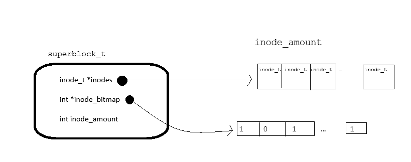
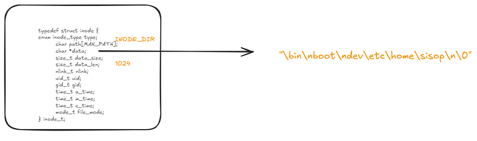
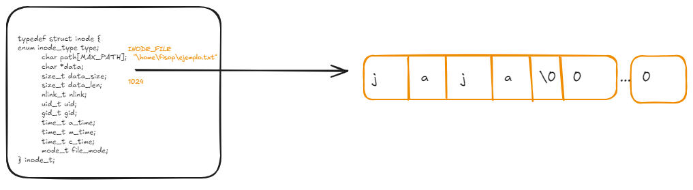
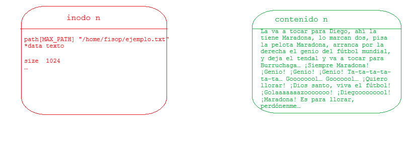

# fisop-fs

## Estructuras

### superbloque

Decidimos modelar nuestro filesystem con una estructura superbloque, compuesta de manera muy similar a la del Very Simple File System. Para el superbloque, nosotros decidimos hacer un tipo de struct de la siguiente forma:

```c
typedef struct superblock {
	inode_t *inodes[NINODES];
	int inode_bitmap[NINODES];
	int inode_number;
} superblock_t;

```

Donde `inode_t` es un array de punteros a inodos y `inode_bitmap` es un array de enteros que representa los inodos libres. El `inode_number` es la cantidad de inodos en uso actualmente en el superbloque.



### inode

inode representa la estructura básica de archivo en el filesystem. Para su definición nos basamos principalmente en la estructura de los inodos de Linux. Los modelamos de la siguiente manera:

```c
typedef struct inode {
	enum inode_type type;
	char path[MAX_PATH];
	char *data;
	size_t data_size;
	size_t data_len;
	nlink_t nlink;
	uid_t uid;
	gid_t gid;
	time_t a_time;
	time_t m_time;
	time_t c_time;
	mode_t file_mode;
} inode_t;
```

Donde la `data` de un archivo es un buffer de memoria dinámica que contiene el contenido del archivo guardado como string (secuencia de char terminada en `/0`) y el `data_size` representa el tamaño del buffer porque el mismo es dinámico.

`data_len` corresponde al string length del contenido de nuestro archivo, que nos viene útil para validar distintas operaciones.

`path` está alocado estáticamente ya que refleja la restricción de anidamiento y largo de nombre de directorio aplicada.


### Inodo de tipo directorio

En nuestro caso, los inodos pueden representar archivos de tipo directorio `INODE_DIR` o de tipo archivo `INODE_FILE`. Para poder representar el tipo de directorio, el contenido del inodo se guarda en el buffer que se compone de una lista de dentries el cual cada dentry esta separado por un `\n` y como especificamos anteriormente, termina en `\0`. Así podemos referenciar múltiples entradas dentro de nuestro directorio, sin límite horizontal, es decir, no hay límite para la cantidad de archivos o subdirectorios que se pueden crear en nuestro filesystem, más allá del tamaño máximo de datos en archivo `MAX_DATA_SIZE`.



### Inodo de tipo archivo

En este caso en particular, el buffer guarda los datos del archivo en el formato explicado anteriormente en . Para este tipo de inodo es muy importante para nosotros llevar el registro del `data_size` y `data_len` ya que nos queremos adelantar a quedarnos sin espacio de escritura, por lo que usamos estas variables para validar si es necesaria una realocación de memoria. Esto nos permite emular el comportamiento real de un sistema de archivos al tratar con esta situación, ya que esta realocación de memoria es 'invisible' para el usuario del filesystem, mientras en el llamado a `stat` solo puede ver como el tamaño de archivo los datos reales escritos. En otras palabras, logramos la virtualización del espacio de memoria en el que se almacena y actualiza el archivo.



### Búsqueda de archivos por un path

Para concretar la acción de busqueda de archivos dado un path, lo que se hace es iterar sobre el vector que contiene los inodos. Ahi se busca los inodos los cuales tengan el mismo path y que en el bitmp tengan `USED` en esa posición. Así hallamos fácilmente el archivo en cuestión, ya que el path de un archivo y otro no puede coincidir ya que no pueden coexistir 2 archivos con mismo nombre y path en un mismo directorio (rompe con la unicidad de los archivos).

## Persistencia en disco

### Serialización y deserialización

Para poder guardar lo que hay dentro del filesystem en el disco se serializan únicamente los inodos en uso en el mismo. Por eso se hace la iteración para buscar esos inodos activos.

Primero se escribe en disco la estructura `inode_bitmap` completa, para así poder realizar esa validación durante la iteración en la deserialización.

Despues de ese proceso, empieza la escritura del disco en sí. En un principio se escriben los inodos activos y los que están en desuso se omiten. En ese proceso de la escritura, se escriben en disco el `inode_t` al que apunta esa posición del array `inodes`; `data_size` y `data_len` crucialmente, para permitirnos en la deserialización saber a la perfección la cantidad de bytes a alocar en memoria nuevamente y recuperar la `data` del inodo; y por último claramente el contenido de la `data`, para así persistir la parte más importante para el usuario del filesystem de todo esto.a

En la deserialización, se lee del archivo persistido en disco lo siguiente.

En primer lugar, el `inode_bitmap`, que nos permitirá encontrar la posición de los inodos a restaurar.

Luego, uno por uno, el espacio a asignar al inodo de tipo `inode_t` que vamos a restaurar en el filesystem.

Después, `data_size` y `data_len`, que nos permiten saber el tamaño en bytes de memoria a alocar y la cantidad de datos a leer y restaurar respectivamente.

Por último, la `data`, de longitud `data_len`. Y esto se repite por todos los inodos en uso.



### tests

Para correr los test es necesario ingresar a la Docker image de nuestro filesystem, pararse sobre el directorio `tests` y ejecutar el archivo correr_los_tests.sh

```bash
#desde terminal 1
make docker-build
make docker-run
make clean
make

#desde terminal 2
make docker-attach

#desde terminal 1
./fisopfs prueba/

#desde terminal 2
cd tests
chmod +x ./correr_los_tests.sh
./correr_los_tests.sh
```
